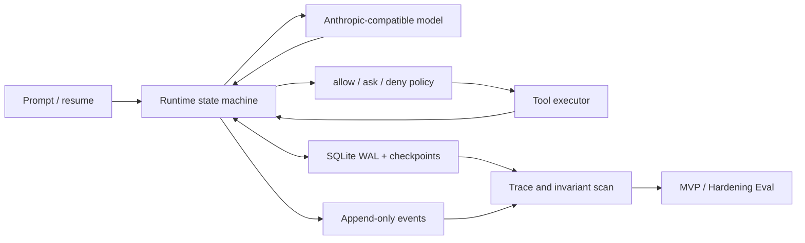

# Durable Agent Runtime

`agent_runtime` is a local execution layer for durable coding-agent tasks. It
starts from the minimal agent-loop ideas taught by learn-claude-code, then adds
the engineering mechanisms needed to recover, constrain, and audit a long-running
task: SQLite checkpoints, an append-only event log, tool-call deduplication,
effect reservations, repository leases, permission policies, file conflict
detection, traces, and deterministic regression evaluation.

The v0.3 development line remains intentionally local and single-repository.
It is not a distributed workflow engine and does not claim generic exactly-once
execution.

## Why this exists

A basic coding-agent loop is easy to express:

```text
model response -> tool call -> tool result -> next model response
```

The difficult cases happen at durable boundaries:

- the model responded, but the process stopped before the response was checkpointed;
- a file write happened, but the tool result was not persisted;
- an old process continued after another owner acquired the repository lease;
- a Shell command may have produced an external effect, but its outcome is unknown;
- a file changed after the agent read it and before the agent attempted an edit.

This Runtime makes those states explicit and fail-closed.

## Relationship to learn-claude-code

learn-claude-code is a progressive teaching repository for agent harness
mechanisms. This package does not replace or modify the teaching sessions. It is
an independent engineering layer built beside them.

| Teaching-harness foundation | Runtime extension |
|---|---|
| Agent loop and tool dispatch | Durable task/checkpoint state machine |
| Tool results in memory | SQLite WAL plus append-only events |
| Direct tool execution | Permission decision, reservation, execution, reconciliation |
| Process-local task ownership | Repository lease and fencing token |
| Happy-path execution | Fault injection and restart recovery |
| Basic tool safety | Path containment, read-before-edit, SHA-256 conflict detection |
| Manual inspection | Trace metrics and fixed Eval suites |

## Architecture



The durable execution order is:

```text
acquire repository lease
-> load/create checkpoint
-> persist model response
-> persist tool plan and permission decision
-> prepare operation + pending outbox + effect reservation
-> claim outbox and mark operation dispatched
-> execute tool
-> commit result/evidence or mark unknown
-> append tool_result checkpoint
-> continue or complete
```

See [architecture and recovery semantics](docs/architecture.md) for the state
model, database tables, and recovery matrix.

## v0.1 capabilities

- SQLite WAL task state, schema versioning, checkpoints, and append-only events.
- Complete model-response, tool-call, file-observation, lease, and reservation records.
- Deduplication by `(task_id, tool_use_id)` plus canonical argument hash.
- Repository lease fencing and an unresolved-effect barrier across tasks.
- `read_file`, `glob`, `write_file`, `edit_file`, and controlled `bash` tools.
- `allow / ask / deny` policies with deny precedence and fail-closed defaults.
- Repository containment, Windows reparse-point checks, and Runtime namespace isolation.
- Read-before-edit, before/after SHA-256 checks, and atomic file replacement.
- Explicit `needs_review` reconciliation through `retry`, `complete`, or `abort`.
- JSON trace summaries/exports and deterministic MVP/Hardening evaluation suites.

## v0.2 Phase 1: Schema Migration and Effect Ledger

Phase 1 upgrades fresh databases directly to schema v5 and provides an
explicit, audited v4-to-v5 migration. Normal Runtime startup never silently
upgrades an existing database:

    python -m agent_runtime db-migrate --repo $sandbox --dry-run
    python -m agent_runtime db-migrate --repo $sandbox
    python -m agent_runtime db-check --repo $sandbox

The migration performs an integrity check, blocks while an unexpired repository
lease exists, creates a SQLite backup through the backup API, records its
filename and SHA-256, converts stale running reservations to unknown, and
commits DDL, backfill, schema metadata, and audit data in one transaction.

Non-read-only calls are represented by an Effect Ledger operation:

    prepared -> dispatched -> committed
           \-> cancelled       \-> failed
    dispatched -> unknown -> committed / prepared / cancelled

read_file and glob remain replay-safe tool-call records without operations.
File writes are reconcilable; Shell is opaque. A committed operation is
deduplicated from its durable result. An unknown opaque operation is blocked
 until an operator uses resolve-call; arbitrary Shell commands are not claimed
 to be exactly-once.

## v0.3 Phase 1: Durable Memory, Context Projector, Plan Store

Phase 1 (v0.3) upgrades the schema to v6 and adds durable long-horizon state:

    memories, memory_links, summaries, plans, plan_items

Before each model call, the runtime runs a read-only `ContextProjector` that
builds a compact model view from the active plan item, memories, summaries, and
recent review/failure evidence. The projection is never written back into
`checkpoints.messages_json`; full conversation history remains the
authoritative execution checkpoint, so recovery and tool/effect deduplication
are unchanged.

Plan items move through a lifecycle of

    pending -> in_progress -> verifying -> completed
                        \-> failed -> retryable

and an item only becomes `completed` after a verifier supplies evidence. Trace
summaries and JSONL exports now include projection token estimates and plan
transition metrics.

## v0.3 Phase 4: Tool Registry + MCP

Phase 4 replaces the static tool map with a durable `ToolRegistry` and adds a
real stdio MCP client. Built-in tools are registry entries, and discovered MCP
tools are exposed as `mcp__<server>__<tool>` with schemas fed into model
context and permission evaluation. Tool and connection metadata lives in
`tool_registrations` and `mcp_connections`; MCP tokens are referenced by
environment variable and never persisted.

Manage connections:

```powershell
python -m agent_runtime mcp add `
  --repo $sandbox `
  --server github `
  --endpoint docker `
  --arg "run" --arg "-i" --arg "--rm" `
  --arg "ghcr.io/github/github-mcp-server" `
  --auth-token-env GITHUB_PERSONAL_ACCESS_TOKEN

python -m agent_runtime mcp refresh --repo $sandbox
python -m agent_runtime mcp list --repo $sandbox
```

`mcp refresh` launches each configured stdio server, registers its tools, and
records `connected` or `error` status. GitHub uses the official
`ghcr.io/github/github-mcp-server` image with a
`GITHUB_PERSONAL_ACCESS_TOKEN` that has `repo`, `read:packages`, and `read:org`
scopes. Add matching `allow` policy rules before the model may call MCP tools.

## v0.3 frozen Exec-Full baseline

The v0.3.0.dev4 baseline combines the durable memory/context, background
jobs/Cron, subagent/mailbox/plan-approval, and ToolRegistry/stdio MCP phases.
Execution checkpoints and full-history resume remain authoritative. The
first-class verified-subtask ledger and semantic checkpointing layer are not
implemented in this baseline and remain deferred to later work.

The fixed review point for Ticket #6 is commit `a16f90e`; the Ticket #6
implementation commit is the handoff point for subsequent work. See the
[v0.3 execution docs](docs/v0.3/README.md) for the phase boundaries and
verification commands.

## v0.3 Recovery Baseline

The accepted Recovery Baseline extends the frozen Exec-Full runtime with
verifier-gated subtask completion, frozen-DAG recovery, stale-evidence refresh,
and fixed-budget Verified-Scoped resume. It uses package version
`0.3.0.dev8` and schema version `v12`.

The accepted code point is commit `bc886fc`, recorded by the annotated tag
`agent-runtime-recovery-code-accepted-2026-09-05`. The tag is the immutable
research comparison point; product development continues from the separate
`codex/long-horizon-agent-v1-bootstrap` line.

The Recovery Baseline deliberately keeps the DAG frozen. Dynamic plan
revision, automatic decomposition, recovery routing, workspace recovery, stuck
detection, model routing, and human escalation belong to the Long-Horizon
Agent product line rather than this baseline.

## Long-Horizon Agent C1a: Immutable Plan Revisions

Product development after the frozen Recovery Baseline uses package version
`0.3.0.dev9` and schema version `v13`. A Plan keeps a stable identity and a
current PlanRevision pointer; every accepted PlanPatch appends an immutable DAG
snapshot and switches that pointer with compare-and-swap in the same
transaction. Completing a dependency satisfies its edge without deleting it.

The public mutation seam is `Runtime.apply_plan_patch(task_id,
expected_revision_id, patch)`. Initial typed operations add a pending PlanItem,
split a failed or retryable PlanItem, update dependencies among non-completed
PlanItems, and tombstone an eligible pending PlanItem. Automatic patch
generation and resume across revised plans remain outside C1a.

## Requirements

- Python 3.11+
- `anthropic`, `mcp`, `python-dotenv`, and `PyYAML`
- `pytest` for the test suite

Install dependencies from the repository root:

```powershell
python -m pip install -r requirements.txt
python -m pip install pytest
```

Real-model runs use the existing Anthropic-compatible environment:

```dotenv
MODEL_ID=GLM-4.5-Air
ANTHROPIC_BASE_URL=https://open.bigmodel.cn/api/anthropic
ANTHROPIC_API_KEY=replace-me
```

Never commit `.env` or credentials.

## Five-minute deterministic demo

The demo needs no API credential and runs only in a disposable directory. It
covers normal edit, crash recovery without a duplicate file effect, and an
external modification conflict that stops in `needs_review`.

```powershell
python -m agent_runtime.demos.run_demo --output-root F:\CodexTemp\agent-runtime-demo
```

Expected summary:

```text
normal_edit       completed    final=NEW_VALUE
crash_recovery    completed    effect_attempts=1
hash_conflict     needs_review final=VERSION_EXTERNAL
```

Each scenario leaves an inspectable `.agent_runtime/runtime.db` and
`trace.jsonl`. See the [demo walkthrough](docs/demo.md).

## Real-model usage

Use an isolated repository for initial validation:

```powershell
$sandbox = "F:\agent-runtime-sandbox"
New-Item -ItemType Directory -Path $sandbox -Force | Out-Null
Set-Content -Path "$sandbox\note.txt" -Value "OLD_VALUE" -Encoding utf8

python -m agent_runtime run `
  --repo $sandbox `
  --prompt "Read note.txt, then replace OLD_VALUE with NEW_VALUE. Do not use Shell."
```

File writes and non-read-only Shell commands require approval unless a policy
explicitly allows them. An existing file must have been observed by the same
task before `edit_file` may change it.

Inspect a task and export its trace:

```powershell
python -m agent_runtime status TASK_ID --repo $sandbox
python -m agent_runtime trace TASK_ID --repo $sandbox --output "$sandbox\trace.jsonl"
```

Resume a non-terminal task:

```powershell
python -m agent_runtime resume TASK_ID --repo $sandbox
```

Operator-oriented commands:

```powershell
python -m agent_runtime list --repo $sandbox
python -m agent_runtime show TASK_ID --repo $sandbox
python -m agent_runtime pending --repo $sandbox
python -m agent_runtime events TASK_ID --repo $sandbox --limit 20
python -m agent_runtime doctor --repo $sandbox
python -m agent_runtime db-check --repo $sandbox
python -m agent_runtime db-migrate --repo $sandbox --dry-run
```

`pending` prints the exact approval, denial, or reconciliation commands for
calls that need operator attention. `doctor` does not call the model; it checks
disk space, temporary storage, model configuration, timeout margin, policy
syntax, SQLite integrity, and Runtime invariants.

Resolve an ambiguous tool effect only after checking the external state:

```powershell
python -m agent_runtime resolve-call TOOL_USE_ID --repo $sandbox --action complete
python -m agent_runtime resolve-call TOOL_USE_ID --repo $sandbox --action retry
python -m agent_runtime resolve-call TOOL_USE_ID --repo $sandbox --action abort
```

- `complete`: the operator confirms the effect already happened.
- `retry`: the operator confirms it is safe to execute again.
- `abort`: terminate the task without replaying the effect.

## Permission policy

The default policy allows repository reads, asks for file writes and Shell, and
denies unknown tools. Hard safety invariants cannot be overridden.

Example `policy.yaml`:

```yaml
rules:
  - id: allow-doc-edits
    effect: allow
    tools: [read_file, write_file, edit_file]
    paths: ["docs/**"]
    reason: Documentation-only task

  - id: allow-git-status
    effect: allow
    tools: [bash]
    command_regex: "git status(?: .*|$)"
    reason: Read-only Git inspection

  - id: deny-generated-secrets
    effect: deny
    tools: [write_file, edit_file]
    paths: ["secrets/**"]
    reason: Reserved secret material
```

Run with the policy:

```powershell
python -m agent_runtime run --repo . --policy policy.yaml --prompt "Inspect the repository"
```

When multiple rules match, precedence is `deny > ask > allow`.

### Protected credential material

v0.1.1 hard-denies direct file and Shell access to common credential paths,
including `.env*`, `.git/**`, private-key formats, `.netrc`, and
common `credentials`/`secrets` data files. Targeted sensitive globs are denied and tool-level
glob results exclude protected matches; broader globs may also fail closed when
they could expose the Runtime namespace. These invariants run before user policy
and cannot be changed to `allow`.

## Regression validation

Run the complete deterministic suite:

```powershell
python -m pytest agent_runtime\tests -q --tb=short
python -m agent_runtime eval --suite evals\mvp.yaml --runs F:\CodexTemp\runtime-mvp
python -m agent_runtime eval --suite evals\hardening.yaml --runs F:\CodexTemp\runtime-hardening
```

Frozen v0.1 acceptance evidence:

- Runtime tests: `113 passed, 2 skipped` (Windows symlink privilege branches).
- MVP Eval: `5/5`, recovery `1/1`.
- Hardening Eval: `9/9`, recovery `7/7`.
- Confirmed duplicate side effects: `0` in the controlled suites.
- Permission bypasses: `0`.
- Durable invariant violations: `0`.
- Controlled real-model read, file-write, and Shell gates: passed in isolated workspaces.

The detailed audit trail is in [HARDENING_LOG.md](HARDENING_LOG.md).
Release-oriented changes are recorded in [CHANGELOG.md](CHANGELOG.md).

## Scope boundaries

The v0.3 Recovery Baseline remains local and single-repository. First-class
verified-subtask checkpoints and semantic ledger state, which the earlier
frozen Exec-Full v0.3.0.dev4 baseline deferred, are included in v0.3.0.dev8.
The following remain deferred beyond the Recovery Baseline:

- lane-aware worktree-based parallel execution;
- retention/GC and the v0.3 release-gate hardening phase;
- distributed or multi-machine coordination;
- a full OS-level Shell sandbox;
- OpenTelemetry and visual dashboards;
- network-filesystem coordination;
- generic distributed exactly-once guarantees;
- OS-level Shell sandboxing (Docker, Bubblewrap, Restricted Token);
- production-scale database retention and migrations.

SQLite is intended for a local filesystem. Shell execution is policy-controlled
but still uses the host shell; it is not equivalent to a container or operating-
system sandbox.

## Project layout

```text
agent_runtime/
  runtime.py       durable loop and recovery
  store.py         SQLite projections, transactions, leases, and ledger API
  migrations.py    explicit v4-to-v13 schema migrations and backup framework
  projector.py     read-only context projector (memories, summaries, plans)
  mcp_client.py    stdio MCP discovery, invocation, timeout, and auth reference
  tool_registry.py durable built-in + MCP tool registry
  effects.py       EffectSemantics and operation specifications
  permissions.py   allow/ask/deny evaluation
  tools.py         repository tools and file safety
  trace.py         metrics and JSONL export
  eval_runner.py   deterministic fixed-task evaluation
  demos/           reproducible no-API demonstrations
  docs/            architecture and walkthroughs
  tests/           fault, security, recovery, migration, ledger, and trace tests
evals/
  mvp.yaml
  hardening.yaml
```
