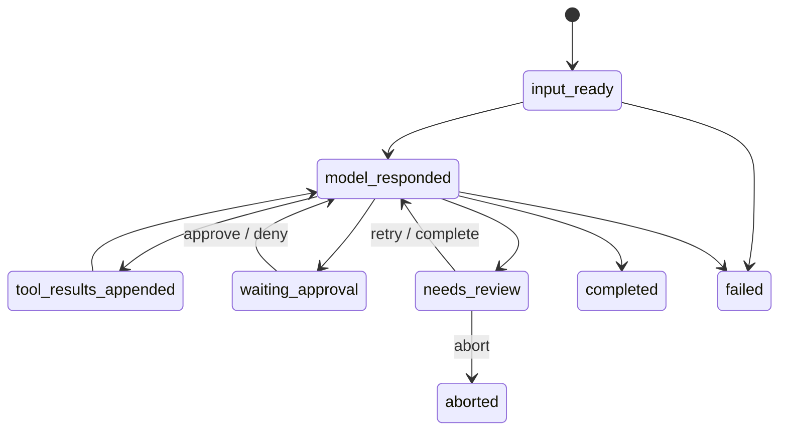

# Architecture and recovery semantics

## Design goal

The Runtime turns a process-local agent loop into a durable local state machine.
SQLite records what the model decided, what the Runtime intended to execute,
what effect may have happened, and what an operator must reconcile.

It deliberately distinguishes execution attempts from confirmed effects. A
successful process return is evidence, not a universal proof that every
external side effect happened exactly once.

## Durable data model

| Table | Purpose |
|---|---|
| `tasks` | Repository, prompt, model, status, checkpoint pointer, version |
| `checkpoints` | Complete message snapshot, phase, and loop cursor |
| `model_calls` | Request/response, stop reason, usage, duration, failure |
| `tool_calls` | Arguments/hash, permission, state, attempts, result, file hashes |
| `file_observations` | Last task-local read state used by read-before-edit |
| `events` | Append-only audit sequence |
| `leases` | Repository owner and monotonically increasing fencing token |
| `effect_reservations` | Non-read-only effect ownership and outcome |
| `operations` | Logical side-effect intent, state, attempts, result digest, and evidence |
| `operation_outbox` | Durable claim/delivery state for effect execution |
| `schema_migrations` | Supported schema version |

SQLite uses WAL, foreign keys, and `synchronous=FULL`. Projection changes and
their audit events are committed in the same transaction at critical state
boundaries.

## Task phases

Terminal tasks (`completed`, `failed`, `aborted`) cannot be resumed or re-enter
the tool execution path.

## Tool recovery matrix

| Interrupted state | Recovery action |
|---|---|
| Persisted terminal tool result | Replay result; do not execute again |
| Same tool ID with different canonical arguments | Fail closed as corrupt state |
| Read-only tool left running | Retry after lease validation |
| File still equals recorded before-state | Require explicit operator retry before another write |
| File equals expected after-state | Mark recovered success without another write |
| File equals neither state | Enter `needs_review`; preserve external content |
| Unknown/non-zero/timed-out Shell effect | Enter `needs_review`; never auto-retry |
| Unresolved repository effect from another task | Block any new side effect |

## Repository ownership

One active lease owns a repository execution lane. Every state-changing store
operation checks the bound owner and fencing token. An expired owner cannot
heartbeat, release a newer lease, update task/tool state, or confirm an effect.

Non-read-only tools create an effect reservation before execution. A dead owner
turns a running reservation into `unknown`. Until that reservation is explicitly
reconciled, other tasks may inspect state but cannot start a new side effect.

## File safety

1. Normalize the repository-relative path.
2. Reject traversal, unsupported drive-relative paths, ADS, symlinks/reparse
   points, and `.agent_runtime` internals.
3. Require a same-task observation before editing an existing file.
4. Calculate the complete before-state SHA-256.
5. Recheck identity and hash immediately before writing.
6. Write to a same-directory temporary file, flush it, and atomically replace.
7. Persist the expected after-state and reservation result.

## Permission semantics

Hard invariants run before configurable rules. Matching configurable rules are
combined with `deny > ask > allow`. A scoped allow/ask policy that does not match
the current path or command fails closed instead of falling back to a permissive
default.

Shell commands receive additional checks for destructive patterns, indirect
wrappers, path escape, expansion, and command composition. Composition cannot be
auto-allowed; it requires an explicit approval unless a hard invariant denies it.

## Observability

Trace summaries derive metrics from durable model, tool, and event records:

- input/output tokens and task duration;
- permission decision counts;
- execution and effect attempts;
- duplicate confirmed effects;
- review correctness;
- stale-lease attempts;
- invariant violations.

JSONL exports redact common credential keys and inline secret assignments.

## Phase 1 schema migration

Schema version 5 is created directly for fresh Runtime databases. Existing v4
databases require the explicit db-migrate command; normal Runtime commands fail
closed with SchemaUpgradeRequired. Versions above v5, versions below v4
without a registered migration, business tables without schema_migrations, and
checksum mismatches are all rejected.

The migration sequence is:

1. Run SQLite integrity and active-lease preflight checks.
2. Take a SQLite backup and verify its integrity and SHA-256.
3. Acquire an exclusive migration transaction.
4. Convert stale running reservations to unknown.
5. Add operation/outbox tables and nullable compatibility projections.
6. Backfill one deterministic operation per task/tool call.
7. Record DDL, backfill, checksum, backup filename, and duration metadata.
8. Commit once; any earlier fault rolls back to a complete v4 database.

The migration never stores an absolute user path in schema metadata. Only the
backup filename and digest are durable.

## Phase 1 Effect Ledger

The four EffectSemantics values are replay_safe, idempotent, reconcilable, and
opaque. read_file and glob use replay_safe tool-call records and do not create
operations. File writes use a file adapter with reconcilable post-state hashes.
Shell uses the opaque semantics: a zero return code is recorded as evidence, not
as a generic exactly-once guarantee.

An operation is prepared together with its outbox and compatibility
effect_reservations row. The current lease claims the outbox, then the Runtime
marks the operation dispatched immediately before crossing the external tool
boundary. Commit, failure, unknown, and reconciliation transitions use
state-plus-version compare-and-swap, lease/fencing validation, compatibility
projection updates, and an append-only event in one SQLite transaction.

The outbox mapping is deliberately conservative:

| Operation state | Outbox state | Recovery meaning |
|---|---|---|
| prepared | pending/claimed | Safe to claim again |
| dispatched | claimed | Boundary was entered |
| committed | delivered | Return the durable result; deduplicate |
| failed | delivered | Effect failure was known |
| unknown | blocked | Never auto-claim; reconcile |
| cancelled | cancelled | Do not execute |

For reconcilable files, a post-write hash match can complete an unknown
operation without another write. If the file still has the before hash, only an
explicit operator retry is allowed. An opaque Shell operation goes to
needs_review. These rules reduce duplicate effects but intentionally do not
claim generic Shell exactly-once execution.

## Scope boundary

Phase 1 remains a local SQLite protocol on a local filesystem. Docker,
Bubblewrap, Windows restricted tokens, MCP, subagents, background scheduling,
Postgres, distributed leases, generic HTTP adapters, dashboards, and a
universal exactly-once declaration are outside this phase.
