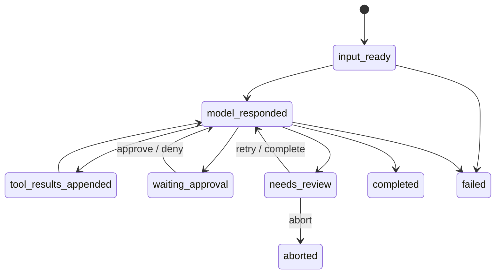

# Architecture and recovery semantics

## Design goal

The Runtime turns a process-local agent loop into a durable local state machine.
SQLite records what the model decided, what the Runtime intended to execute,
what effect may have happened, and what an operator must reconcile.

It deliberately distinguishes execution attempts from confirmed effects. A
successful process return is evidence, not a universal proof that every
external side effect happened exactly once.

## Durable data model

| Table | Purpose |
|---|---|
| `tasks` | Repository, prompt, model, status, checkpoint pointer, version |
| `checkpoints` | Complete message snapshot, phase, and loop cursor |
| `model_calls` | Request/response, stop reason, usage, duration, failure |
| `tool_calls` | Arguments/hash, permission, state, attempts, result, file hashes |
| `file_observations` | Last task-local read state used by read-before-edit |
| `events` | Append-only audit sequence |
| `leases` | Repository owner and monotonically increasing fencing token |
| `effect_reservations` | Non-read-only effect ownership and outcome |
| `schema_migrations` | Supported schema version |

SQLite uses WAL, foreign keys, and `synchronous=FULL`. Projection changes and
their audit events are committed in the same transaction at critical state
boundaries.

## Task phases

Terminal tasks (`completed`, `failed`, `aborted`) cannot be resumed or re-enter
the tool execution path.

## Tool recovery matrix

| Interrupted state | Recovery action |
|---|---|
| Persisted terminal tool result | Replay result; do not execute again |
| Same tool ID with different canonical arguments | Fail closed as corrupt state |
| Read-only tool left running | Retry after lease validation |
| File still equals recorded before-state | Revalidate policy and execute once |
| File equals expected after-state | Mark recovered success without another write |
| File equals neither state | Enter `needs_review`; preserve external content |
| Unknown/non-zero/timed-out Shell effect | Enter `needs_review`; never auto-retry |
| Unresolved repository effect from another task | Block any new side effect |

## Repository ownership

One active lease owns a repository execution lane. Every state-changing store
operation checks the bound owner and fencing token. An expired owner cannot
heartbeat, release a newer lease, update task/tool state, or confirm an effect.

Non-read-only tools create an effect reservation before execution. A dead owner
turns a running reservation into `unknown`. Until that reservation is explicitly
reconciled, other tasks may inspect state but cannot start a new side effect.

## File safety

1. Normalize the repository-relative path.
2. Reject traversal, unsupported drive-relative paths, ADS, symlinks/reparse
   points, and `.agent_runtime` internals.
3. Require a same-task observation before editing an existing file.
4. Calculate the complete before-state SHA-256.
5. Recheck identity and hash immediately before writing.
6. Write to a same-directory temporary file, flush it, and atomically replace.
7. Persist the expected after-state and reservation result.

## Permission semantics

Hard invariants run before configurable rules. Matching configurable rules are
combined with `deny > ask > allow`. A scoped allow/ask policy that does not match
the current path or command fails closed instead of falling back to a permissive
default.

Shell commands receive additional checks for destructive patterns, indirect
wrappers, path escape, expansion, and command composition. Composition cannot be
auto-allowed; it requires an explicit approval unless a hard invariant denies it.

## Observability

Trace summaries derive metrics from durable model, tool, and event records:

- input/output tokens and task duration;
- permission decision counts;
- execution and effect attempts;
- duplicate confirmed effects;
- review correctness;
- stale-lease attempts;
- invariant violations.

JSONL exports redact common credential keys and inline secret assignments.
